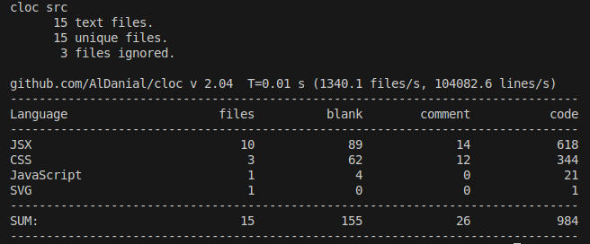

## Project structure

    src/pages/ → contains route-based components (e.g., Login, Dashboard).
    src/components/ → reusable UI components
    src/hooks/ → custom hook for managing logic in components.
    src/styles/ → centralized styling files, for now for only ChatViewer

## stats

## Build and Copying to EC2 instance
Build using

    npm run build

Copy to EC2 using

    scp -i WPkeypair.pem  -r dist/* <username>@<EC2_url>:<dir_on_ec2>
